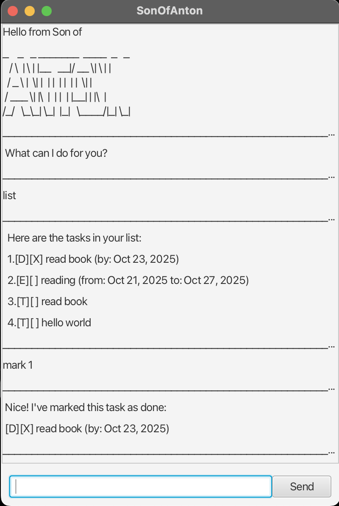

# SonOfAnton User Guide

## Introduction
SonOfAnton is a task manager chatbot with a GUI built using JavaFX.  
You can add, list, mark, unmark, delete, and search tasks.

## Features
- **Add tasks**
    - `todo <desc>`
    - `deadline <desc> /by <date>`
    - `event <desc> /from <date> /to <date>`
- **List tasks**: `list`
- **Mark/unmark tasks**: `mark <index>`, `unmark <index>`
- **Delete tasks**: `delete <index>`
- **Find tasks**: `find <keyword>`
- **Exit**: `bye`

## Example
todo read book, 
deadline return book /by Oct 23 2025,
list,
mark 1,
bye
